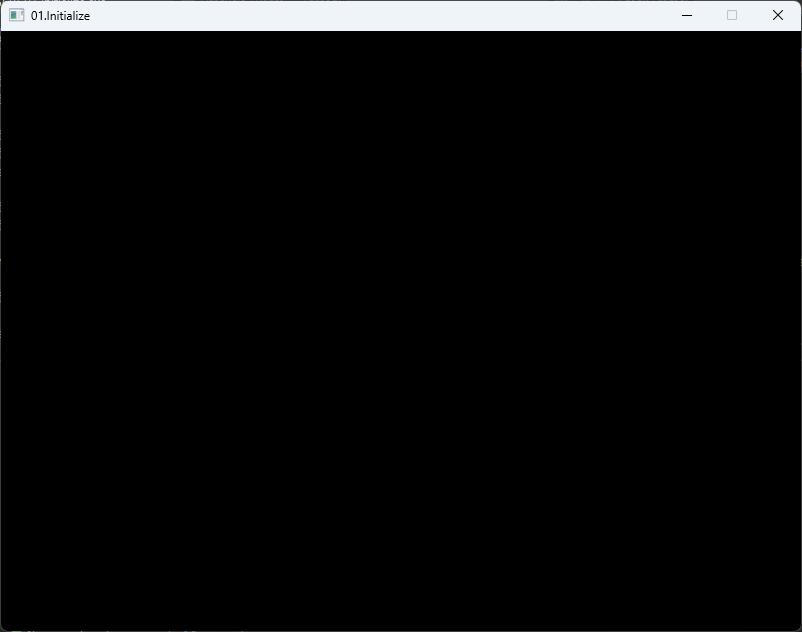
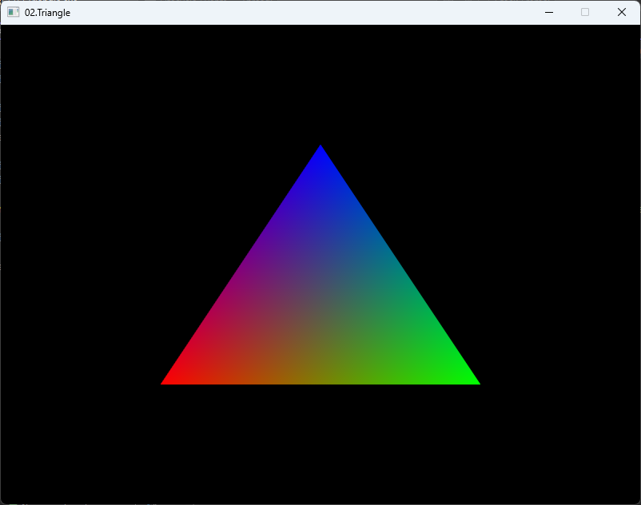
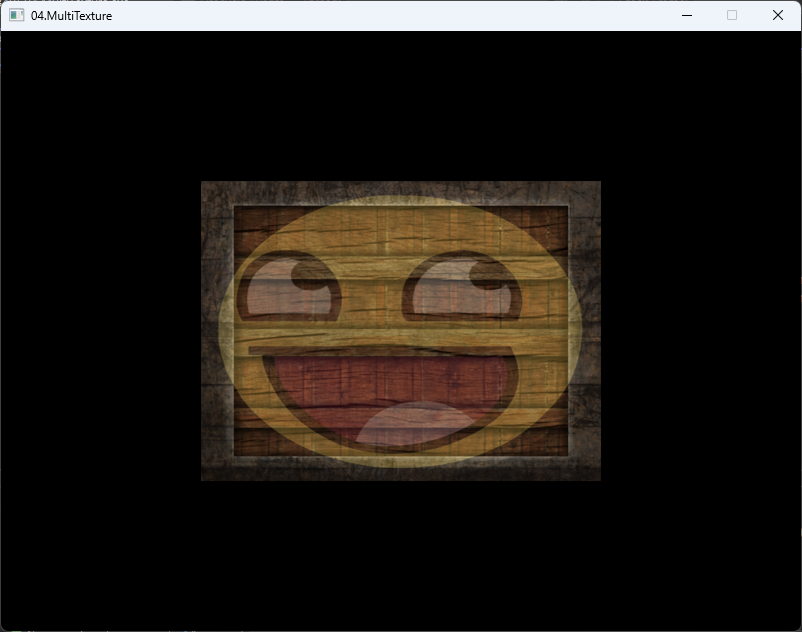

# GameMaker
- `GameMaker` is Game engine for 2D/3D game development.

## Support Platform
- Windows 10/11 Home/Pro

## Dependencies
- [Git](https://git-scm.com/)
- [Visual Studio 2022](https://visualstudio.microsoft.com/ko/)
- [CMake 3.27 or later](https://cmake.org/)
- [Python 3.x](https://www.python.org/)
- [NSIS](https://nsis.sourceforge.io/Download)

## Getting Started

To develop a game using `GameMaker`, you need to follow the steps below.

- Run the following command to clone the repository.
  ```
  git clone https://github.com/ChoiJiOne/GameMaker.git
  ```
- Next, run the `Setup.bat` script to create the project. The `<name>` argument is the name of the project you want to create.
  ```
  Setup.bat <name>
  ```
- Finally, run the `GenerateProjectFiles.bat` script to create the Visual Studio solution.
  ```
  GenerateProjectFiles.bat
  ```

## Sample

<table>
  <tr>
    <td>
    <a href="./GameMaker/Sample/01.Initialize/">01.Initialize</a>
    </td>
    <td>
    
    </td>
  </tr>
  <tr>
    <td>
    <a href="./GameMaker/Sample/02.Triangle/">02.Triangle</a>
    </td>
    <td>
    
    </td>
  </tr>
  <tr>
    <td>
    <a href="./GameMaker/Sample/03.Texture/">03.Texture</a>
    </td>
    <td>
    
    </td>
  </tr>
  <tr>
    <td>
    <a href="./GameMaker/Sample/04.MultiTexture/">04.MultiTexture</a>
    </td>
    <td>
    
    </td>
  </tr>
</table>