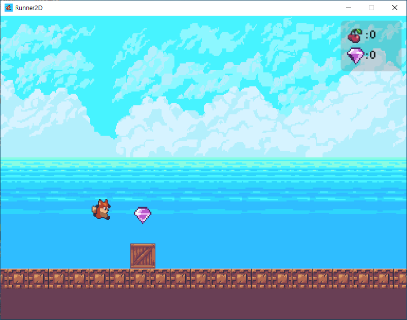
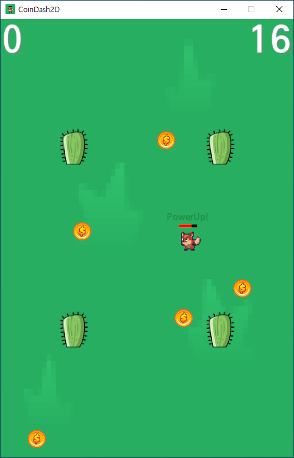
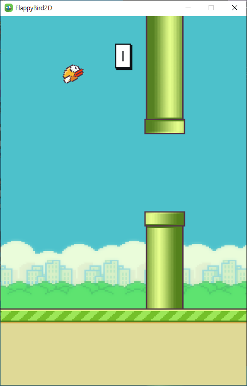

# GameMaker
- `GameMaker` is Game engine for 2D/3D game development.

## Support Platform
- Windows 10/11 Home/Pro

## Dependencies
- [Git](https://git-scm.com/)
- [Visual Studio 2022](https://visualstudio.microsoft.com/ko/)
- [CMake 3.27 or later](https://cmake.org/)
- [Python 3.x](https://www.python.org/)
- [NSIS](https://nsis.sourceforge.io/Download)

## Getting Started

To develop a game using `GameMaker`, you need to follow the steps below.

- First, create a git project in the desired folder.
  ```
  git init
  ```
- Next, use the following command to add the `GameMaker` engine to the project.
  ```
  git submodule add https://github.com/ChoiJiOne/GameMaker.git
  ```
- After that, run the `Setup.bat` script to create the project. The `<name>` argument is the name of the project you want to create.
  ```
  GameMaker\\Script\\Setup.bat <name>
  ```
- Finally, run the `GenerateProjectFiles.bat` script to create the Visual Studio solution.
  ```
  GenerateProjectFiles.bat
  ```

## Update

To update the `GameMaker` to the latest version, execute the following command.

```
git submodule update --remote
```

## Game

### [Runner2D](https://github.com/ChoiJiOne/Runner2D)
- `Runner2D` is a project for developing a Runner 2D game based on GameMaker.
  

### [CoinDash2D](https://github.com/ChoiJiOne/CoinDash2D)
- `CoinDash2D` is a project for developing a Coin dash 2D game based on GameMaker.
  

### [FlappyBird2D](https://github.com/ChoiJiOne/FlappyBird2D)
- `FlappyBird2D` is a project for developing a 2D Flappy Bird game based on GameMaker.
  
